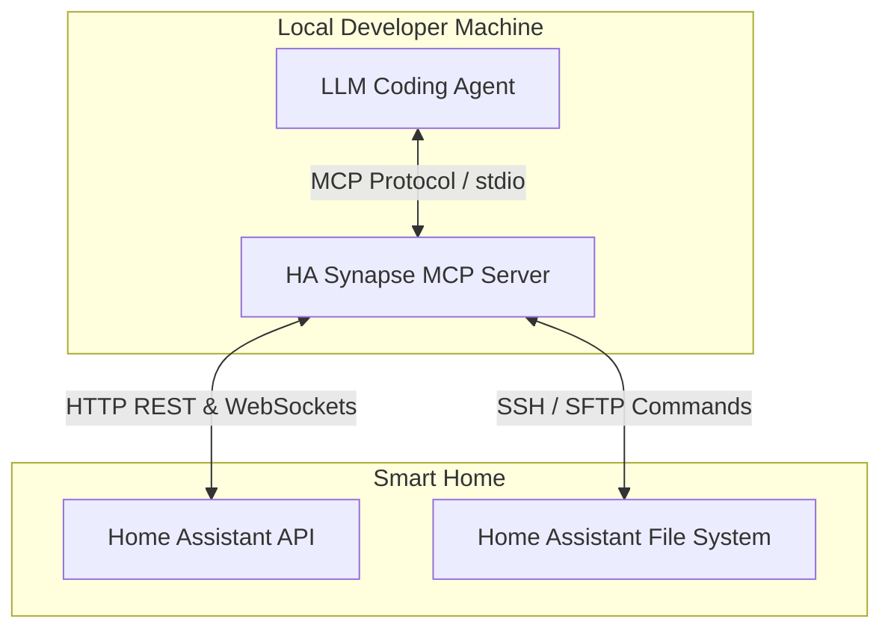

# HA Synapse 🧠

**HA Synapse** is a robust Model Context Protocol (MCP) server designed to act as a bridge between LLM coding agents (such as Antigravity, Claude Code, Cursor, or Codex) and your **Home Assistant** instance(s). 

Rather than executing ad-hoc API scripts, **HA Synapse** provides a standardized set of MCP tools and resources. This allows AI agents to read and modify configuration files safely, call services, dry-run templates, query history, and debug automation traces dynamically.

---

## Architecture: Where does HA Synapse live?

**HA Synapse runs on the local machine where the coding agent executes** (e.g., your laptop or development desktop). 



It communicates over the network with one or more Home Assistant instances:
1. **REST & WebSockets**: Used for real-time state caching, service execution, template rendering, history, and automation traces.
2. **SSH Connection**: Used to read/write configuration files (like `configuration.yaml` or packages) directly inside the `/config` or `/homeassistant` folders without requiring custom HACS components on the Home Assistant side.

---

## Key Features

1. **Multi-Instance Support**: Manage multiple Home Assistant installations (e.g., `home` and `office`) from a single MCP server.
2. **Real-time State Caching**: Maintains an active WebSocket connection to keep an in-memory copy of all entity states, preventing context bloat and rate-limiting.
3. **Atomic Writes & Safety Guard**:
   * Checks YAML syntax locally.
   * Backs up files in `.mcp_backups/` before modifying them.
   * Runs Home Assistant's configuration validation check after writing.
   * **Automatically rolls back** to the original file if validation fails, preventing your smart home from locking up.
4. **Jinja2 Template Testing**: Exposes a template rendering tool, letting the AI verify calculation outcomes before deploying them in automations.
5. **Automation Tracing**: Exposes execution traces to let the AI see exactly which condition failed in a broken automation.

---

## Installation & Setup

### 1. Prerequisites

1. **Home Assistant Access Token**:
   * Open your Home Assistant UI, click on your profile (bottom left), go to the **Security** tab, and click **Create Token** at the bottom. Save this Long-Lived Access Token.
2. **SSH Connection (For File Editing)**:
   * Install the official **Advanced SSH & Web Terminal** add-on in Home Assistant.
   * Configure key-based authentication in the add-on settings and expose port `22`.

### 2. Configuration File

Create a configuration file named `.ha-synapse.json` in your user's home directory (e.g. `C:\Users\<username>\.ha-synapse.json` or `~/.ha-synapse.json`):

```json
{
  "defaultInstance": "home",
  "instances": {
    "home": {
      "url": "http://10.0.2.52:8123",
      "token": "YOUR_LONG_LIVED_ACCESS_TOKEN",
      "mode": "ssh",
      "remoteConfigDir": "/homeassistant",
      "ssh": {
        "host": "10.0.2.52",
        "port": 22,
        "user": "root",
        "keyPath": "C:\\Users\\<username>\\.ssh\\id_ed25519"
      }
    },
    "office": {
      "url": "http://192.168.1.100:8123",
      "token": "ANOTHER_LONG_LIVED_TOKEN",
      "mode": "local",
      "localConfigDir": "/config"
    }
  }
}
```

---

## Commands

Install dependencies:
```bash
npm install
```

Compile TypeScript to Javascript:
```bash
npm run build
```

Run integration test suite:
```bash
npm run test-conn
```

Start the MCP server:
```bash
npm start
```

---

## Integrating with Claude Desktop

To use HA Synapse with Claude Desktop, add it to your `claude_desktop_config.json` configuration (typically found at `%APPDATA%\Claude\claude_desktop_config.json`):

```json
{
  "mcpServers": {
    "ha-synapse": {
      "command": "node",
      "args": ["/path/to/ha-synapse/build/index.js"],
      "env": {
        "HA_MCP_CONFIG_PATH": "/path/to/ha-synapse/ha-synapse.json"
      }
    }
  }
}
```

---

## Exposed MCP Tools

* **Entity Exploration**:
  * `get_entity_list`: Returns `friendly_name`, `entity_id`, and `state`.
  * `get_entity_details`: Returns full attributes of selected entity IDs.
  * `search_entities`: Search by area, domain, or query matching.
* **Control**:
  * `call_service`: Execute any Home Assistant service (e.g. `light.turn_on`, `tts.speak`).
* **Configuration & File Management**:
  * `read_ha_file`: Sandbox-constrained file read.
  * `write_ha_file`: Safety-wrapped file writing with config validation rollback.
  * `validate_ha_config`: Triggers configuration check.
  * `reload_ha`: Reloads core, templates, automations, scripts, and themes.
  * `restart_ha`: Restarts the Home Assistant core.
* **Orchestration & Diagnostics**:
  * `render_template`: Evaluates Jinja2 template strings in the HA engine.
  * `get_history`: Fetches historical state changes.
  * `get_automation_traces`: Fetches run histories of automations.
  * `get_automation_trace_details`: Fetches execution steps of a specific trace.
